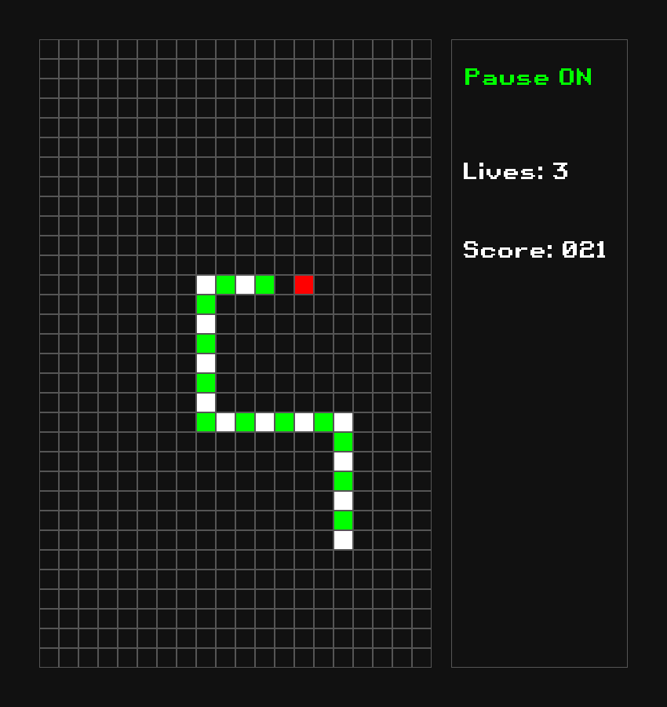

# Snake Game in C using SDL

    
    

        Screenshot from the game:
    

    

        Compilation and running:
    

    <pre>
    $ ./build.sh
    $ ./snake
    </pre>

    

        Control keys:
    

    <pre>
    j - left
    l - right
    i - up
    k - down

    Space - pause
    Esc - quit
    </pre>

